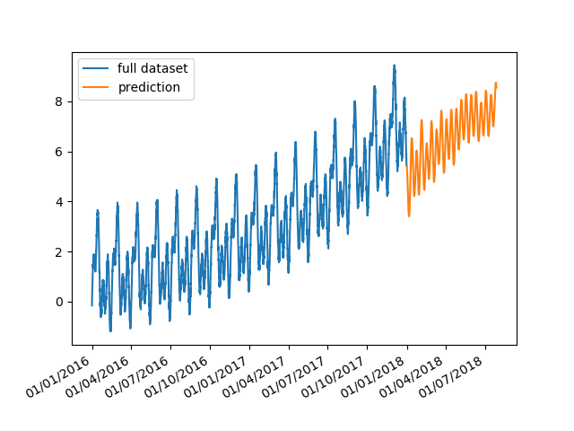
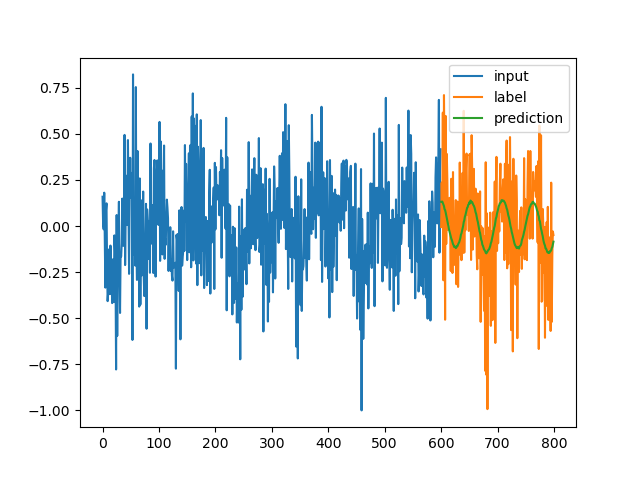

# BIT-Recruitment-AI-assignment

## Task

The goal of the project is to predict the next 6 month of a time series. The result can be seen in the following plot:



## Dependencies

The project is using Python 3.7 and Anaconda. To install the Anaconda environment use
```
conda env create -f environment.yml
```

## Model

It uses a two-layer LSTM as sequence to sequence model. The model predicts a configurable amount of future data points from a given sequence of data points. It is assumed that the data points are equally spaced.

To simplify training the difference between data points is used rather than there absolute value and the data set is normalized.

Usually the output of the model is much shorter than the required 6 month period. In order to create predictions for the full 6 month we predict one window, then append it to the data set and use the tail of the data set for the next prediction. This is repeated until the predictive tail is 6 month long.

The figure `plot_single.png` shows input, label and prediction for a single data window.

